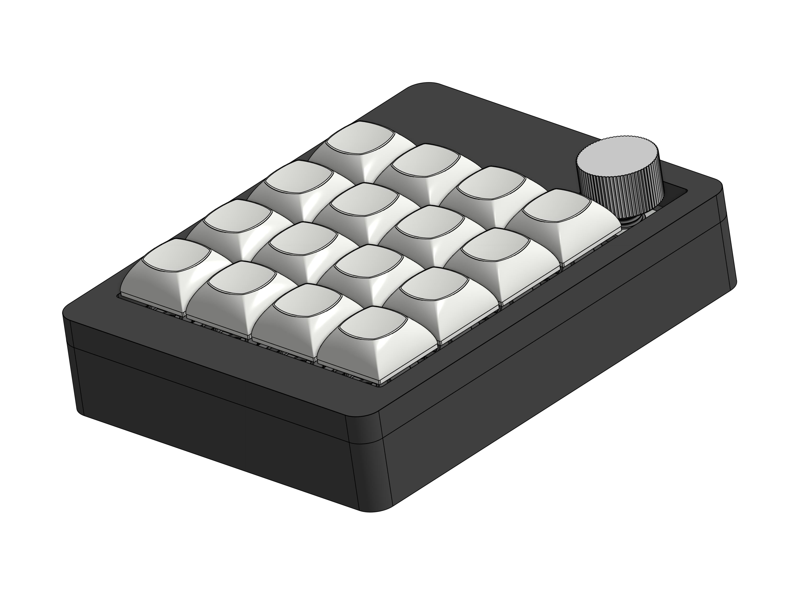
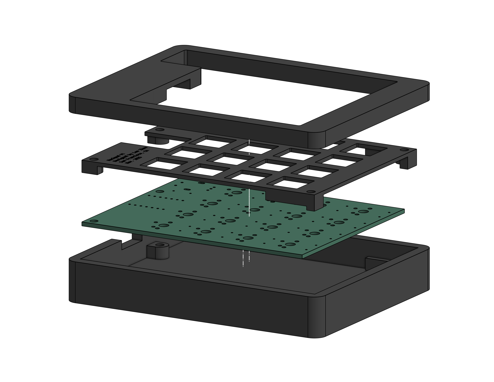
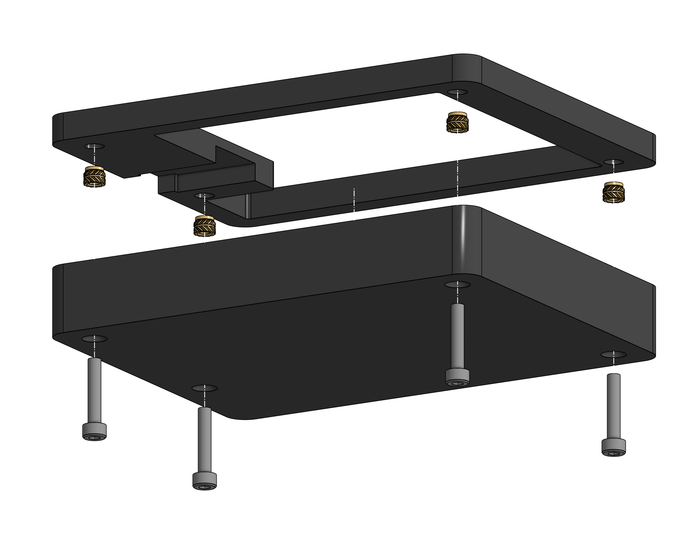
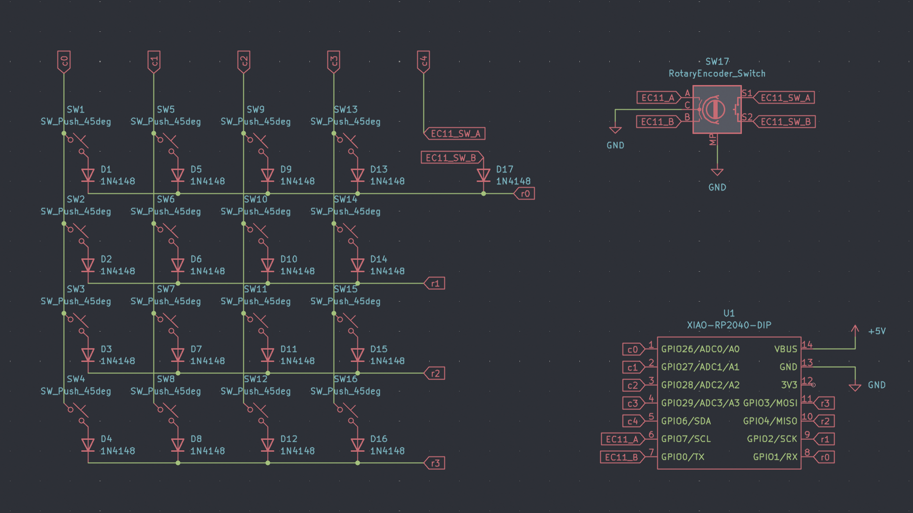
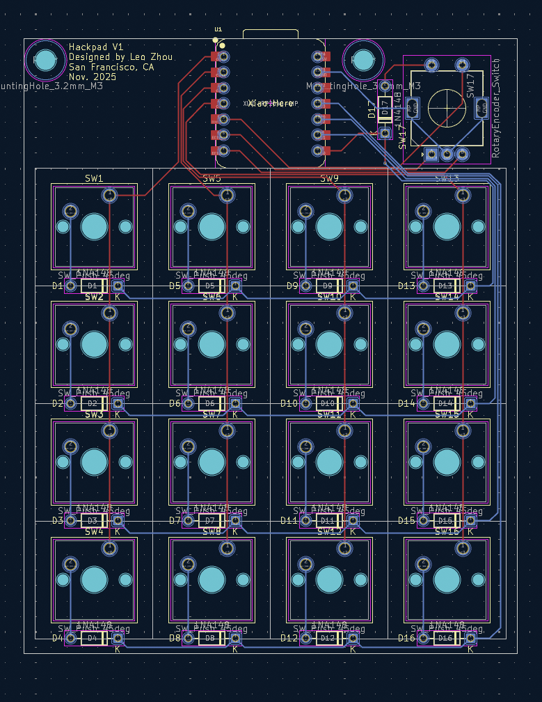

# Leo's Hackpad #

My submission for Hack Club Blueprint.<br>


## Features ##
- 16 keys arranged in a 4x4 matrix
- Rotary encoder for volume control
- Rotary encoder doubles as a play/pause button
- USB-C connectivity
- 3D Printed Case


## Case ##
The case consists of three parts: the top, bottom, and switch plate. 
The three parts are secured with M3x16mm bolts and heat set inserts. Refer to the images below for assembly.
Designed in Onshape.<br>



## PCB ##
The PCB contains a 4x4 column to row matrix for the switches, with an extra column added for the switch on the rotary encoder. The encoder used is an EC11.
The matrix uses 1N4148 diodes to prevent ghosting. 
A through-hole mounted Seeed Studio XIAO RP2040 serves as the controller.
Designed in KiCad.<br>




## Firmware ##
The firmware is QMK. The keymap is currently configured as a numpad.

```            
            ┌───┐
            │Vol│
┌───┬───┬───┼───┤
│ 7 │ 8 │ 9 │ / │
├───┼───┼───┼───┤
│ 4 │ 5 │ 6 │ * │
├───┼───┼───┼───┤
│ 1 │ 2 │ 3 │ - │
├───┼───┼───┼───┤
│ 0 │ . │Ent│ + │
└───┴───┴───┴───┘
```
The rotary encoder is located where `vol` is. It works as volume control when rotated (CW - Vol Up / CCW - Vol Down), and can play/pause when pressed.<br>

## BOM ##

- 4x M3x16mm SCHS Bolts
- 4x M3x⌀5mmx4mm Heat Set Inserts
- 16x Cherry MX Style Switches
- 1x EC11 Rotary Encoder
- 17x 1N4148 DO-35 Diodes
- 1x Seeed Studio XIAO RP2040
- 1x 3D Printed Case
    - Case Top
    - Case Bottom
    - Switch Plate
- 1x 3D Printed Knob 

